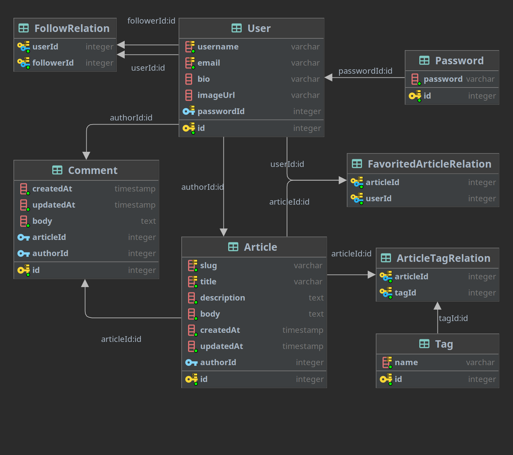

# 

> ### NestJS codebase containing real world examples (CRUD, auth, advanced patterns, etc) that adheres to the [RealWorld](https://github.com/gothinkster/realworld) spec and API.

### Demo: https://demo.realworld.io/;

### RealWorld: https://github.com/gothinkster/realworld;

This codebase was created to demonstrate a fully fledged fullstack application built with **NestJS** including CRUD
operations, authentication, routing, pagination, and more.

I've gone to great lengths to adhere to the **NestJS** community styleguide & best practices.

For more information on how to this works with other frontends/backends, head over to
the [RealWorld](https://github.com/gothinkster/realworld) repo.

# How it works

> Describe the general architecture of your app here

# Getting started

> npm install, npm start, etc.

# Entity Relation Diagram

